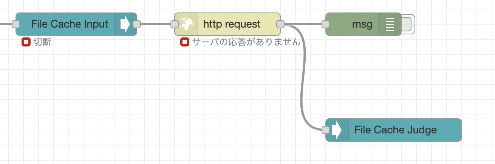

# 概要
`node-red-contrib-httpPostCache`はhttp requestノードの前後に配置して、http postに失敗(statusCodeが200以外)だった場合にmsgをファイルに保存していき、正常にpostができるようになったらhttp postをするノードです。

送信に失敗したメッセージは、指定のパスに1メッセージ1ファイルで保存していきます。
{指定のパス}/{年月日}/{時刻}/{timestamp}.json

送信ができるようになったら、指定した時間間隔で古いメッセージから順次送信していきます。
送信対象の期間は指定することができます。

送信完了したデータはcacheから削除されます。残ったファイルは未送信データになります。

# 使い方

1. http requestノードの前に httpPostCacheのinputを、http requestノードの後ろにhttpPostCacheのjudgeを配置してください。

2. `path`にはhttpPostCacheのconfigで送信失敗したメッセージを保存するパス(実在するパス)を指定してください。
3. `interval`(ms)にはミリ秒単位の送信間隔を指定してください。送信が成功して未送信データが残っている場合、ここで設定した時間間隔でメッセージを送信していきます。送信が失敗した時の再送間隔は`前回の再送間隔 * 2（最大5分）`になります。
4. `expiration`は現時点から何日前のデータまで送信するか指定するパラメータです。`expiration=1`が設定されると、2日前以前のデータは送信されません。

